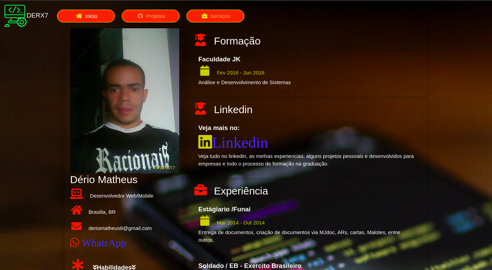

# DERX7
-Veja as novidades do Portfólio <b>DERX7</b>
<h2>Tecnologias usadas</h2>
<label>Html5</label>
<label>CSS3</label>
<label>Boostrap</label>
<label>JS</label>
<label>JQuery</label>

<h3>Novidades</h3>

<ul>
<li>
    
Icones do Font Awesome

    <a href="https://fontawesome.com/icons" target="_blank">FontAwesome</a>
</li>

</ul>

<h3>Nota de Versão</h3>
<ul>
<li>
    
Em breve Lançamento da Versão V_11(Atualmente)

    
Veja em:<a href="https://derio123.github.io/DERX7/" target="_blank">DERX7</a>

    

    
Versão V_10(Anterior)

    
Veja em:<a href="https://derio123.github.io/DERX7/" target="_blank">DERX7</a>

</li>
</ul>
